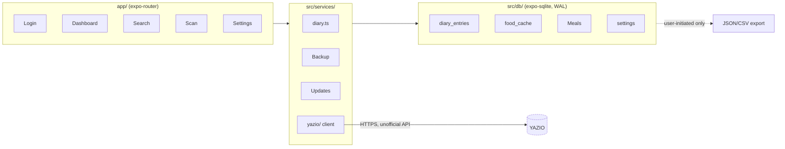

# Dietinator architecture

How the app is built and why. Short version: **local-first diary**, optional
best-effort YAZIO sync, everything on-device.

## Big picture

## Layering rules

- `app/*` screens compose UI and call `src/services/*`. No SQL or YAZIO
  calls in route files.
- `src/services/*` own business logic and orchestrate `src/db/*`.
- `src/db/*` own the SQLite schema, queries, and JSON mapping. DB row shapes
  align with interfaces in `src/types/index.ts`. JSON columns
  (`nutrients_json`, `serving_json`) are parsed at the service boundary.
- `src/utils/*` are pure, unit-tested helpers (date, nutrients, units, retry,
  barcode).

## Local-first diary flow

1. The user logs food. The app writes the `diary_entries` row immediately,
   so logging needs no network round-trip.
2. If `yazio_sync_enabled` (settings), `syncEntryToYazio` /
   `syncPendingEntries` (`src/services/yazio/sync.ts`) pushes it best-effort.
3. YAZIO failures never block the diary. Entries keep `yazio_synced = 0` and
   sync later, or the UI shows the offline banner and keeps working.

## YAZIO client lifecycle

- Singleton in `src/services/yazio/client.ts`:
  `initYazioClient()`, `getYazioClient()`, `loginWithCredentials()`,
  `logoutYazio()`.
- Credentials and tokens live in `src/services/yazio/auth-storage.ts`
  (expo-secure-store, with a prefixed localStorage fallback on web).
- Flaky calls go through `withRetry` (`src/utils/retry.ts`). It retries 5xx
  and 429 responses, not most other 4xx responses.

## Data model

| Table           | Purpose                                                | Sync state                      |
| --------------- | ------------------------------------------------------ | ------------------------------- |
| `diary_entries` | Logged meals. Id is `TEXT PRIMARY KEY` from sync layer | `yazio_synced`, `yazio_item_id` |
| `food_cache`    | YAZIO products, favorites, recents                     | `last_used_at`                  |
| `meals`         | Foods you often eat together                           | None                            |
| `settings`      | Single row `id = 1`: goals, `yazio_sync_enabled`       | None                            |

Schema changes go through `migrate()` in `src/db/database.ts` only, as additive
`IF NOT EXISTS` columns for compatibility.

## Boot sequence

`AppProvider` (`src/context/AppContext.tsx`):

1. `getDatabase()` + migrate
2. `refreshSettings()` / `refreshAuth()`
3. When `ready === true`, `app/_layout.tsx` routes to `/login` or `/(tabs)`

## Web specifics

- Metro is the only web bundler in SDK 56 (no Vite).
- The dev server proxies `/api/yazio` to avoid CORS problems with
  `yzapi.yazio.com`. `serve-dist.mjs` does the same for the production export,
  with COEP/COOP headers for SQLite-in-WASM isolation.
- SQLite runs in WASM/OPFS on web. Secure-store falls back to prefixed
  localStorage (`src/utils/secure-storage.ts`).

## Release pipeline

- `pnpm run release [major|minor|patch]` bumps `app.json`
  (version and deterministic versionCode), commits, and tags `vX.Y.Z`.
- Tag push triggers `.github/workflows/release.yml`: typecheck, lint, coverage and an APK build, then a GitHub release with a changelog from conventional commits.
- The Android app checks GitHub releases on start and offers an in-app update with the changelog.
- Web deploys live at [dietinator.kadatodev.workers.dev](https://dietinator.kadatodev.workers.dev). Cloudflare Pages builds `dist/` from `master`. The YAZIO proxy lives in `functions/api/yazio/[[path]].js`.
