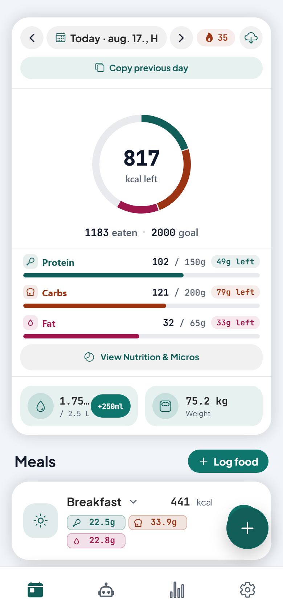
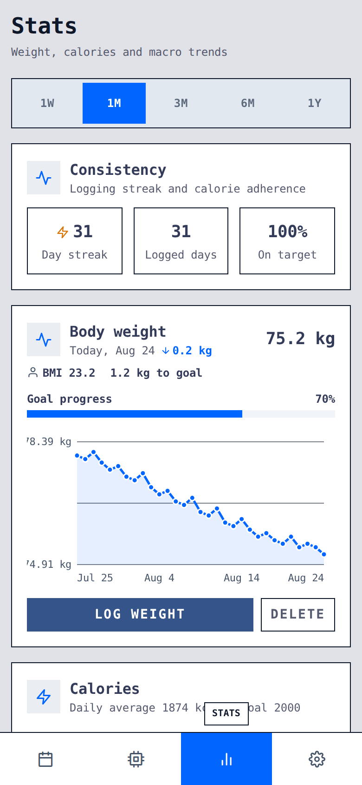
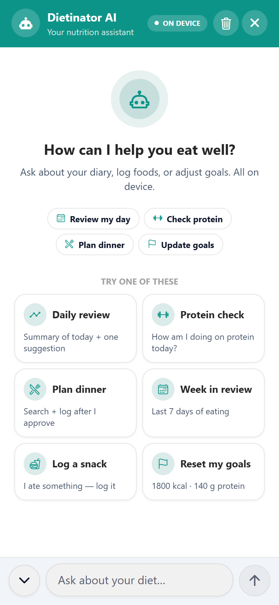
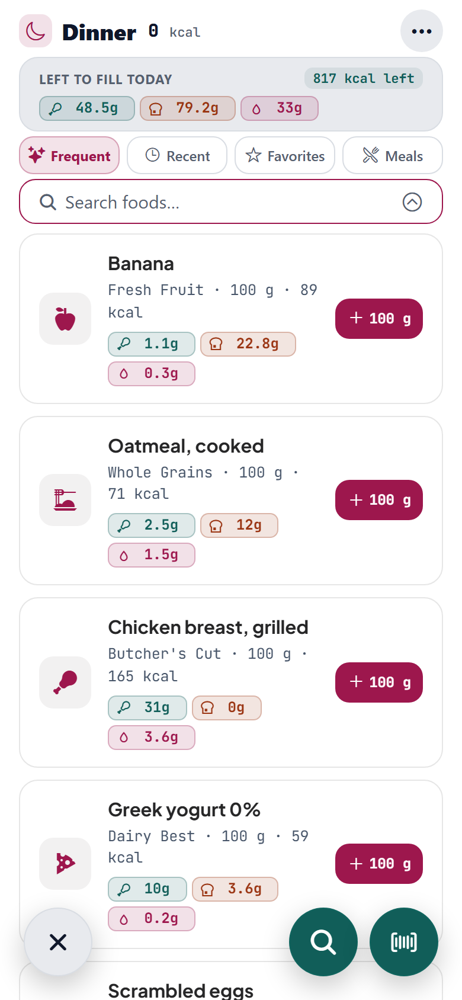
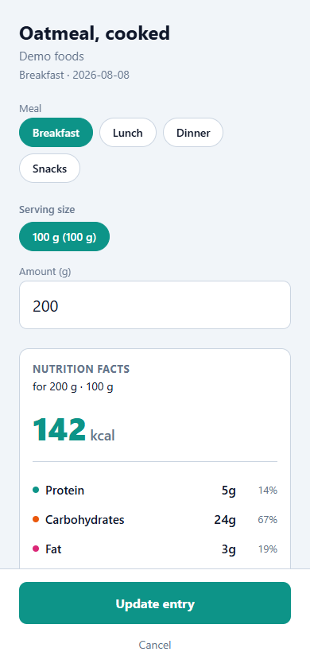
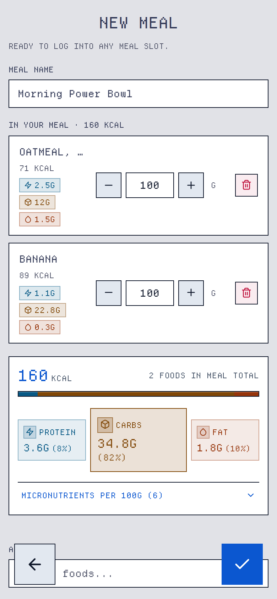
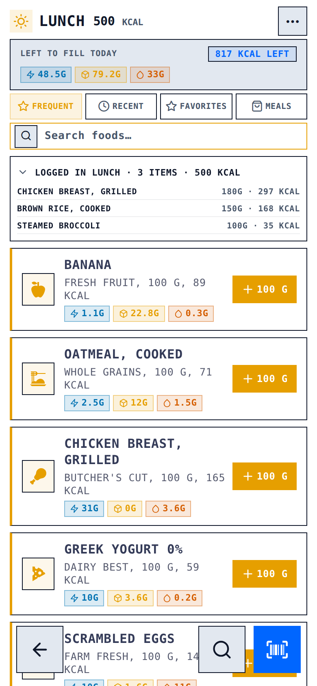
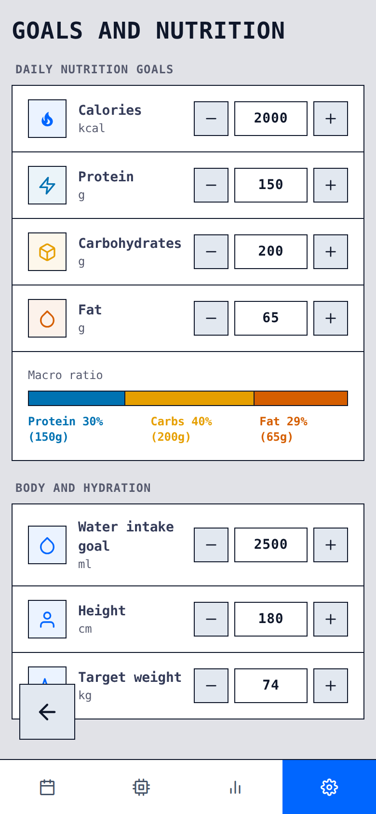

# Dietinator

<div align="center">

[](https://github.com/tothKarolyDavid/Dietinator/actions)
[](https://github.com/tothKarolyDavid/Dietinator/releases/latest/download/Dietinator-Android.apk)
[](https://www.typescriptlang.org)
[](https://expo.dev)
[](LICENSE)

A calorie tracker that works **offline first**. Your diary lives in
local SQLite, food search comes from the YAZIO food database, and sync back to
your account is optional and best-effort. No account needed to try it.

</div>

> **Try it:** build the web app and open `/?demo=1`, or tap **Explore the demo**
> on the login screen. A full demo session seeds itself, no account required.

## Download

**Android.** Install the latest signed build directly:

<div align="center">

[](https://github.com/tothKarolyDavid/Dietinator/releases/latest/download/Dietinator-Android.apk)

</div>

- The link always points at the newest release. Every tag push rebuilds and
  re-attaches the signed APK via `.github/workflows/release.yml`.
- On first install, allow **Install unknown apps** for your browser when prompted.
- The app checks GitHub for newer versions on startup from the Settings screen
  and offers a one-tap download when one is out. Updates never touch your local diary.

## Preview

<div align="center">

<p align="center">
<strong>Daily dashboard</strong> · <strong>Stats &amp; trends</strong> · <strong>AI assistant</strong><br><br>
<picture>
  <source media="(prefers-color-scheme: dark)" srcset="./docs/screenshots/dashboard-dark.png">
  
</picture>
&nbsp;&nbsp;
<picture>
  <source media="(prefers-color-scheme: dark)" srcset="./docs/screenshots/stats-dark.png">
  
</picture>
&nbsp;&nbsp;
<picture>
  <source media="(prefers-color-scheme: dark)" srcset="./docs/screenshots/ai-chat-dark.png">
  
</picture>
</p>

<p align="center">
<strong>Food search &amp; favorites</strong> · <strong>Food &amp; portion details</strong> · <strong>Meal builder</strong><br><br>
<picture>
  <source media="(prefers-color-scheme: dark)" srcset="./docs/screenshots/search-dark.png">
  
</picture>
&nbsp;&nbsp;
<picture>
  <source media="(prefers-color-scheme: dark)" srcset="./docs/screenshots/add-food-dark.png">
  
</picture>
&nbsp;&nbsp;
<picture>
  <source media="(prefers-color-scheme: dark)" srcset="./docs/screenshots/meal-builder-dark.png">
  
</picture>
</p>

<p align="center">
<strong>Meal slot tracking</strong> · <strong>Goals &amp; settings</strong><br><br>
<picture>
  <source media="(prefers-color-scheme: dark)" srcset="./docs/screenshots/log-meal-dark.png">
  
</picture>
&nbsp;&nbsp;
<picture>
  <source media="(prefers-color-scheme: dark)" srcset="./docs/screenshots/settings-dark.png">
  
</picture>
</p>

</div>

## Features

- **Local-first diary.** Instant logging to SQLite with WAL mode, fully offline, cached foods included.
- **Daily dashboard.** Dynamic calorie ring, macro budget bars, color-coded meal sections, water logging, weight tracking, and a one-tap "Copy previous day" shortcut.
- **Live daily budget impact.** Real-time calculation when logging food showing exactly how adding an item impacts your remaining calories, macros, and daily targets before saving.
- **Micronutrient tracking.** Detailed vitamins and minerals breakdown modal (fiber, sugar, saturated fat, sodium, potassium, calcium, iron, and more) available from the dashboard and food logs.
- **Food search and dynamic icons.** Debounced YAZIO search with multilingual dynamic food category icon resolution, favorites and recents kept visible, and SQLite caching.
- **Serving sizes and portions.** Named portions such as cup, whole, piece, or custom gram amounts with remembered quantities from your previous logs.
- **Numeric steppers and repeat actions.** Minus and plus buttons on all numeric fields with press-and-hold repeat for fast adjustments.
- **Meal builder and Quick Add.** Save reusable food combinations with quantity steppers and aggregate nutrition facts, or quickly log calories and macros directly.
- **Real-time meal slot budgeting.** The logging screen displays remaining meal slot budgets, daily totals, instant-add pill actions, and inline entry editing.
- **Barcode scanning.** Fast camera-based EAN/UPC barcode scanner on mobile devices with cache-first lookup.
- **Water and body weight tracking.** Log daily hydration with quick-add presets (+250ml) and record weight check-ins with BMI calculation and trend charts.
- **AI assistant.** In-app nutrition assistant with support for OpenAI, OpenRouter, Ollama, and any OpenAI-compatible provider. Features streaming answers, on-device tools over SQLite, destructive action confirmations, and persistent chat history.
- **Agent API (MCP).** Model Context Protocol endpoint at `/mcp` exposing real-time diary snapshots and tools to external coding and desktop agents such as Claude Desktop or Cursor.
- **Backup, export and restore.** Export diary data to CSV or JSON, and perform full on-device database backup and restore.
- **In-app updates on Android.** Automatic GitHub release checks on startup with one-tap background APK download and direct package installation.
- **Demo mode.** Try all features and explore a populated session with a single tap, no account required.
- **Light and dark themes.** Full theme system with system preference detection and responsive mobile and desktop layouts.

## Tech stack

| Area      | Choice                                                                         |
| --------- | ------------------------------------------------------------------------------ |
| Framework | Expo SDK 56 · React Native · expo-router                                       |
| Database  | expo-sqlite, WAL journal mode, migrations in `src/db/database.ts`              |
| UI        | gluestack-ui v3 + NativeWind v4                                                |
| Sync      | unofficial `yazio` npm client, `withRetry`, offline-first                      |
| AI chat   | OpenAI-compatible streaming client under `src/services/ai/`, tools over SQLite |
| Agent API | MCP server in `scripts/mcp-server.cjs`, served by Metro and `serve:web`        |
| Updates   | expo-intent-launcher, GitHub releases pipeline                                 |
| Auth/data | expo-secure-store, React Context                                               |
| Tests     | Jest unit tests · Playwright e2e on the web build                              |
| Quality   | TypeScript strict, ESLint, Prettier, husky, coverage gates, gitleaks           |

## Getting started

```bash
nvm use            # Node 22 (.nvmrc)
npm install
npm start          # Metro: scan the QR with Expo Go
npm run web        # or run in the browser
```

The dev scripts pin port **9082** (`--port 9082`). Expo's default (8081) is
inside the Hyper-V excluded range on Windows dev machines, which made the
CLI fall into an interactive port prompt that breaks in non-TTY shells. If
9082 is taken, pass another free port explicitly, e.g. `npm start -- --port 9090`.

Useful: `npm run test:coverage` · `npm run test:e2e` · `npm run build:web` ·
`npm run typecheck` · `npm run lint`

## Testing & CI

Jest unit tests cover the pure logic: date math, nutrient conversions, retry
policy, backup round-trip, DB migrations, AI streaming and tools, MCP server
and agent bridge. Playwright e2e drives the web build at phone dimensions
through boot, demo mode, diary CRUD, offline search, backup and restore, and
the AI chat surface. CI runs typecheck, lint, format, coverage, e2e and a
secret scan on every push.

## AI assistant & Agent API (MCP)

### In-app chat

Enable **AI Assistant** in Settings and pick a provider preset: OpenAI,
OpenRouter, OpenCode, Ollama, or any OpenAI-compatible API. The preset fills
the base URL and a default model. Add your API key. It is stored in the device
keystore, with prefixed localStorage on web, and only ever sent to the provider
you configured. Use **Fetch models** to list available models or **Test
connection** to verify the endpoint. The assistant can read your diary, look up
foods, log entries, manage meals and update goals using on-device tools.
Destructive actions show an Approve or Decline card first. The chat opens with
one-tap presets for a daily review, protein check, dinner plan, week in review,
snack log and goal reset. History lives in SQLite so it survives restarts.

### Agent API (`/mcp`)

The web host, Metro dev server or `npm run serve:web`, mounts a stateless
Model Context Protocol server at `/mcp` plus a same-origin snapshot bridge at
`/api/agent/*`:

1. The web app pushes a snapshot of the last 14 diary days, goals, water, weight, meals,
   and favorites on boot and after every data change. The snapshot is in-memory only, nothing
   touches disk.
2. Any MCP client, such as Claude Desktop, Cursor or MCP Inspector, connects to
   `http://localhost:9082/mcp` (the default dev/serve port on this machine —
   see below) and gets these tools:
   `get_diary`, `get_diary_stats`, `get_water`, `get_weight`, `get_meals`,
   `get_favorite_foods`, `get_goals`, `get_settings`, `get_health_summary`,
   `log_food`, `log_water`, `log_weight`, `log_meal`, `save_meal`,
   `update_food_entry`, `delete_food_entry`, `delete_water`, `delete_weight`,
   `delete_meal`, `toggle_favorite`, `set_goals`, `set_units`, `set_profile`.
   Write tools mirror their changes into the snapshot, so multi-step agent flows work seamlessly.
3. Agent changes are queued as a revisioned change log. The app pulls and
   applies them into SQLite on the next dashboard focus.

Protect the endpoint with an API key: `MCP_API_KEY=… npm run serve:web`.
Clients send `X-Api-Key` or `Authorization: Bearer`. In production mode the
key is mandatory. Optional browser-based MCP clients can be allowed with
`MCP_CORS_ORIGINS=…`.

Live-check the whole surface with a real model:
`OPENCODE_API_KEY=sk-… npm run test:mcp`. It boots `/mcp`, drives an agent
loop through every tool, and validates the change feed.

## More

- [ARCHITECTURE.md](ARCHITECTURE.md) covers the data model, local-first flow
  and release pipeline.
- [CHANGELOG.md](CHANGELOG.md) holds the version history, and `npm run release`
  cuts a new one.
- Releases build a signed Android APK via `.github/workflows/release.yml`.
  See [Download](#download) for the latest APK and how in-app updates work.

> **Note:** this app uses a reverse-engineered, unofficial YAZIO API. Personal
> use only, it may break without notice. The local-first design keeps the app
> fully usable when it does.
