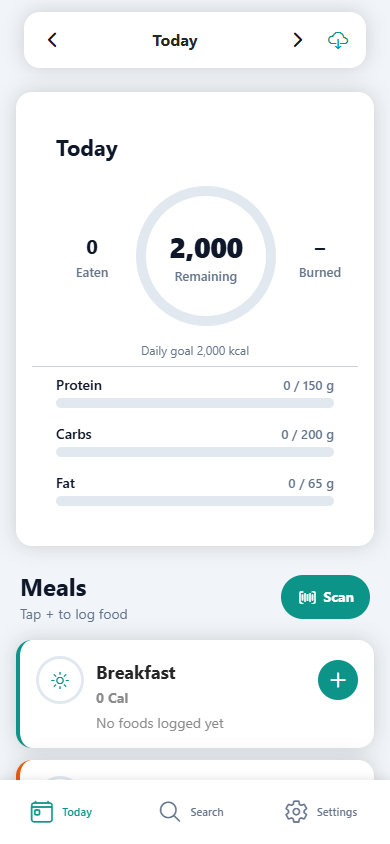
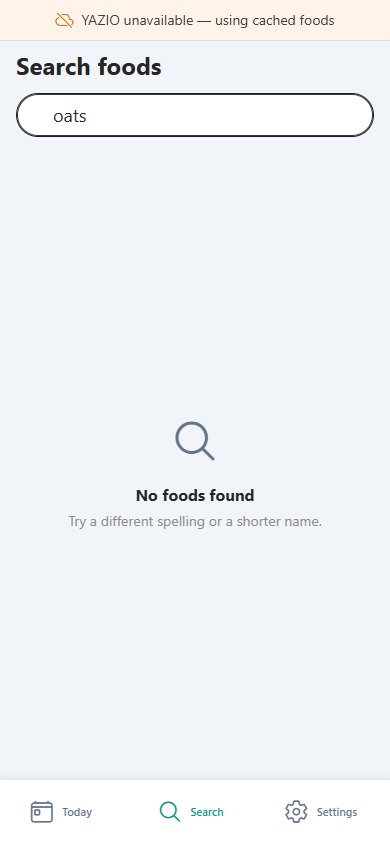
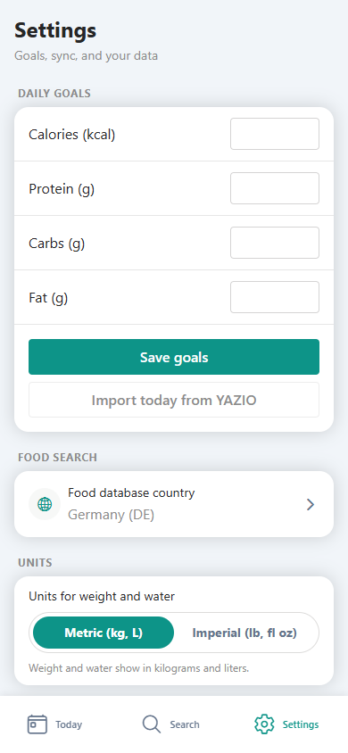

# Dietinator

[](https://github.com/tothKarolyDavid/Dietinator/actions)
[](https://www.typescriptlang.org)
[](https://expo.dev)
[](LICENSE)

Fast, ad-free calorie tracker for personal use. Logs meals locally in SQLite,
searches YAZIO's food database via the unofficial [yazio](https://www.npmjs.com/package/yazio)
npm client, and syncs back to your account best-effort.

<div align="center">
  
  
  
</div>

> **Try it without an account:** build the web app and open `/?demo=1`, or tap
> "Explore the demo (no account)" on the login screen.

## Why local-first?

The diary is the source of truth and lives **on your device**:

- Logging is instant — a SQLite write, no network round-trip.
- Everything works offline, including cached foods, favorites and meals.
- Optional YAZIO sync is best-effort: when the API is down (it can break
  without notice, it is unofficial), the diary keeps working and pending
  entries sync later.
- Your data is yours: export or **back up all data as one JSON file** and
  restore it on any device. No ads, no analytics SDKs, no accounts required
  (a YAZIO account is optional).

## Features

- Local-first diary with a daily calorie/macro dashboard and meal sections
- YAZIO food search (debounced, SQLite-cached, favorites + recents)
- Barcode scanning (EAN/UPC) with cache-first lookup
- Manual entries, meals (foods you often eat together), Quick Add
- Optional best-effort sync to your YAZIO account
- Backup/restore of all local data (diary, cache, settings, meals)
- Export diary as JSON or CSV (CSV cells are quoted and formula-safe)
- In-app update dialog with changelog (Android, via GitHub releases)
- Demo mode — explore the full UI without an account
- Web build with a service worker (offline + instant repeat loads)

## Tech stack

| Area       | Choice                                                                        |
| ---------- | ----------------------------------------------------------------------------- |
| Runtime    | Node ≥ 20.19.4 (`.nvmrc` → Node 22 LTS)                                       |
| Framework  | Expo SDK 56, React 19, React Native 0.85                                      |
| Navigation | expo-router (file-based routes)                                               |
| Database   | expo-sqlite (WAL), migrations in `src/db/database.ts`                         |
| UI         | gluestack-ui v3 + NativeWind v4 (Tailwind)                                    |
| Auth/state | expo-secure-store, React Context                                              |
| Camera     | expo-camera (barcode scan — device/dev build)                                 |
| Sync       | unofficial `yazio` npm client, `withRetry` policy, offline-first              |
| Tests      | Jest + jest-expo (unit), Playwright (e2e on the web build)                    |
| Quality    | ESLint (eslint-config-expo), Prettier, husky + lint-staged, TypeScript strict |

## Screens

```
app/
  login.tsx          # YAZIO sign-in (+ demo mode)
  (tabs)/            # Today dashboard · Search · Settings
  log-meal.tsx       # modal — log a food
  add-food.tsx       # modal — amount/serving/preview
  manual-entry.tsx   # modal — foods without a barcode
  meal-builder.tsx   # modal — compose a meal
  scan.tsx           # modal — barcode camera
src/
  db/                # SQLite schema + queries (diary, food_cache, settings, meals)
  services/          # business logic: diary, backup, demo, yazio/*, updates
  components/        # presentational UI
  utils/             # date, nutrients, units, retry, barcode, …
```

## Requirements

- **Node.js 20.19.4+** (Expo SDK 56). Use `nvm use` (reads `.nvmrc`, Node 22 LTS).
- Expo Go or a development build (camera barcode scanning needs a device)
- A YAZIO account (optional — everything works without one)

## Setup

```bash
cd Dietinator
npm install
npm start
```

Scan the QR code with Expo Go, or run `npm run android` / `npm run ios`.

For **web** in the browser: `npm run web`. YAZIO API calls are proxied through
Metro at `/api/yazio` during development so the browser is not blocked by CORS
on `yzapi.yazio.com`.

> **Why not Vite?** Expo SDK 56 removed Vite support (since SDK 52 the only
> web bundler is Metro). The fastest supported loops are `npm run dev:web`
> (hot reload) and `npm run test:e2e:dev` (Playwright against the dev server).

## Commands

| Command                     | What it does                                                                                |
| --------------------------- | ------------------------------------------------------------------------------------------- |
| `npm start` / `npm run dev` | Metro dev server (native + web)                                                             |
| `npm run dev:web`           | Metro dev server for the browser, hot reload                                                |
| `npm run typecheck`         | `tsc --noEmit` over the whole project                                                       |
| `npm run lint`              | ESLint (eslint-config-expo, flat config)                                                    |
| `npm run format`            | Prettier — write across the repo                                                            |
| `npm run format:check`      | Prettier — verify (CI)                                                                      |
| `npm test`                  | Jest unit tests (utils, services, DB migrations)                                            |
| `npm run test:coverage`     | Jest with coverage — CI enforces the thresholds in `package.json`                           |
| `npm run release`           | Bump version + tag `vX.Y.Z` (one command; then push the tag)                                |
| `npm run build:web`         | Production web export to `dist/`                                                            |
| `npm run serve:web`         | Serve `dist/` locally (COEP/COOP headers + YAZIO proxy, gzip). Requires a prior `build:web` |
| `npm run web:prod`          | Build + serve in one shot                                                                   |
| `npm run test:e2e`          | Build web + run Playwright (phone viewport, offline/local-first flows)                      |
| `npm run test:e2e:headed`   | Same, with a visible browser                                                                |
| `npm run test:e2e:dev`      | Playwright against a running `npm run dev:web` (fast iteration, no rebuild)                 |
| `npm run test:e2e:yazio`    | Real-account suite (skips unless `.env.local` has credentials)                              |
| `npm run test:e2e:install`  | Download the Chromium test browser                                                          |

## Testing

**Unit tests** (`npm test`): Jest + jest-expo covering the pure logic the app
depends on — date math, nutrient normalization (the per-gram vs per-100 g
conversion is the classic calorie-tracker bug), unit conversion, retry policy,
barcode matching, food result merging, backup validation/restore, diary service
business rules (mocked DB), and the SQLite migration contract.

`npm run test:coverage` collects coverage with enforced global thresholds
(statements/lines 75%, functions 70%, branches 60% — `coverageThreshold` in
`package.json`). CI runs it on every push, so coverage can't silently slip.

**E2E tests** (`npm run test:e2e`): Playwright against the **web build at phone
dimensions** (390×844). They seed a fake local session
(`calorie_tracker_yazio_logged_in` in localStorage) so the whole diary works
offline — no YAZIO credentials needed. Covered flows: boot/auth gating, demo
mode, diary CRUD with delete confirmation, date navigation, offline search
with the offline banner, and a full backup → delete → restore round-trip.

**Real-account YAZIO tests** (`e2e/yazio.spec.ts`) sign in with your actual
YAZIO credentials and exercise live search, logging, sync, and delete. They
only run when `.env.local` contains credentials — the file is gitignored and
never committed:

```bash
# .env.local  (never commit)
YAZIO_EMAIL=you@example.com
YAZIO_PASSWORD=your-password

npm run test:e2e:yazio
```

These tests create one consumed item on the real YAZIO account and delete it
again afterwards.

**CI** runs typecheck, lint, format check, unit tests, e2e, and a gitleaks
secret scan on every push/PR (`.github/workflows/ci.yml`). A pre-commit husky
hook runs `lint-staged` (eslint --fix + prettier) on staged files.

Playwright's MCP server is configured for AI agents in `.opencode/opencode.json` —
it lets an agent drive the browser, screenshot the app, and iterate on UI
without hand-written selectors.

## Reproducible dev environment (recommended)

Local Node version mismatches (wrong `node` on PATH, old npm `node` package,
peer dependency errors) are the usual cause of Metro/Babel failures. Pin the
toolchain instead of relying on whatever is installed globally.

### Dev Container (best default in Cursor/VS Code)

1. Install [Docker Desktop](https://www.docker.com/products/docker-desktop/) and the **Dev Containers** extension.
2. Command palette → **Dev Containers: Reopen in Container**.
3. Inside the container: `npm start` or `npm run web`.

The container uses **Node 22** from `.devcontainer/devcontainer.json` and runs `npm ci` on create. Expo/Metro ports are forwarded automatically.

### Docker Compose (web-only)

```bash
docker compose up --build
```

Then open the URL Metro prints (typically `http://localhost:8081` or `8082`).

**Note:** Expo Go on a physical phone still needs Metro reachable on your LAN.
Run `npm start` on the **host** (or use tunnel mode) for mobile; use the
container mainly for **web** and for consistent `npm install` / CI.

### Local Node (without Docker)

```bash
nvm use          # Node 22 from .nvmrc
node -v          # must be >= 20.19.4
npm install
npm start
```

Do **not** install the npm package named `node` in your home directory — it is
not the Node.js runtime and will break Expo.

## Security & privacy

- Credentials and tokens live in the device secure store (`expo-secure-store`;
  web falls back to prefixed `localStorage` — documented in `src/utils/secure-storage.ts`).
- No analytics SDKs, no network calls except YAZIO (and the GitHub releases
  check for updates).
- Data exports and backups are user-initiated; nothing is uploaded anywhere.
- CI runs a **gitleaks secret scan** on every push. `.env.local` is gitignored.
- `npm audit`: the two remaining advisories (`image-size`, `uuid`) are
  dev/build-time dependencies of the Expo/Metro toolchain with no fix without a
  breaking SDK downgrade; they never ship in the app bundle.

## Important

This app uses a **reverse-engineered, unofficial** YAZIO API. It may break
without notice and is intended for **personal use only** — do not productize or
redistribute access to it. The local-first design keeps the app usable when the
API is unreachable.

## Architecture

See [ARCHITECTURE.md](ARCHITECTURE.md) for the system overview — data model,
local-first flow, YAZIO client lifecycle, and boot sequence.

## Releasing a new version (Android)

Releases are published from GitHub by tagging the repository. The
`.github/workflows/release.yml` pipeline runs on every `v*` tag:

1. **Tests** - typecheck and the offline/local-first e2e suite (YAZIO specs skip without credentials).
2. **Signed APK** - `expo prebuild` + a production Gradle build, signed with your release keystore.
3. **Release** - a GitHub release with the `Dietinator-Android.apk` asset and a changelog generated
   from conventional commits (`feat:`, `fix:`) since the previous tag. The app shows that changelog
   (markdown) in the in-app update dialog.

### One-time setup: signing keystore

Create a keystore (keep it forever - the app updates must keep the same signature):

```bash
keytool -genkeypair -v -keystore dietinator-release.keystore -alias dietinator \
  -keyalg RSA -keysize 2048 -validity 10000
```

Add these repository secrets (Actions > Settings > Secrets):

| Secret                      | Value                                    |
| --------------------------- | ---------------------------------------- |
| `ANDROID_KEYSTORE_BASE64`   | `base64 -w0 dietinator-release.keystore` |
| `ANDROID_KEYSTORE_PASSWORD` | Keystore password                        |
| `ANDROID_KEY_ALIAS`         | `dietinator`                             |
| `ANDROID_KEY_PASSWORD`      | Key password                             |

### Mobile builds (EAS)

[`eas.json`](eas.json) defines three EAS Build profiles (see
[Expo docs](https://docs.expo.dev/build/eas-json/)):

| Profile       | Use                                                      |
| ------------- | -------------------------------------------------------- |
| `development` | Debug dev-client build for devices (camera, SecureStore) |
| `preview`     | Internal test build, installable without a store         |
| `production`  | Store-ready build; `autoIncrement` bumps versionCode     |

```bash
npx eas build --profile development   # on-device dev build
npx eas build --profile preview       # shareable test APK
npx eas build --profile production    # store build
```

`expo-updates` is installed so `production` builds can ship OTA updates via
EAS Update channels once you run `npx eas update:configure`.

### Publishing a release

1. `npm run release [major|minor|patch]` bumps `app.json` (`version`, and `android.versionCode`),
   commits, and tags `vX.Y.Z`. Or let the pipeline derive the version from the tag
   (`v1.1.0` -> version `1.1.0`, versionCode `10100`).
2. Push the tag:

```bash
git tag v1.1.0
git push origin v1.1.0
```

3. The workflow builds the APK, creates the release with auto-generated changelog notes, and the
   Android app prompts with the update dialog on next start (Settings > Updates to disable).

For a manual trigger without a tag, run the workflow from the Actions tab and provide the version.

### How the in-app updater works

- On Android, the app silently checks GitHub's latest release 4 seconds after startup
  (once per session). If the release tag is newer than the installed version, an update dialog
  shows the changelog (markdown-rendered) with **Download** (opens the signed APK in the browser),
  **Later**, and **Don't ask again** (disables the startup check in Settings > Updates).
- Check for updates manually at any time from Settings > Updates.

## License

MIT — see [LICENSE](LICENSE). Not affiliated with YAZIO.
