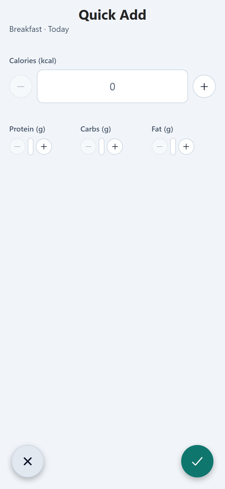
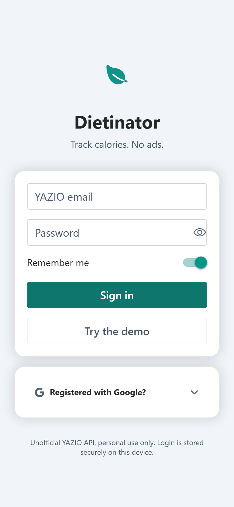

# Dietinator

<div align="center">

[](https://github.com/tothKarolyDavid/Dietinator/actions)
[](https://www.typescriptlang.org)
[](https://expo.dev)
[](LICENSE)

A fast, ad-free calorie tracker that works **offline first**. Your diary lives in
local SQLite, food search comes from the YAZIO food database, and sync back to
your account is optional and best-effort. No account needed to try it.

</div>

> **Try it:** build the web app and open `/?demo=1` — or tap **Explore the demo**
> on the login screen. A full demo session seeds itself, no account required.

## Preview

<div align="center">

<p align="center">
<strong>Diary</strong> · <strong>Food search</strong> · <strong>Log a food</strong><br><br>
<picture>
  <source media="(prefers-color-scheme: dark)" srcset="./docs/screenshots/dashboard-dark.png">
  
</picture>
&nbsp;&nbsp;
<picture>
  <source media="(prefers-color-scheme: dark)" srcset="./docs/screenshots/search-dark.png">
  
</picture>
&nbsp;&nbsp;
<picture>
  <source media="(prefers-color-scheme: dark)" srcset="./docs/screenshots/add-food-dark.png">
  
</picture>
</p>

<p align="center">
<strong>Quick Add</strong> · <strong>Meal builder</strong> · <strong>Diary details</strong><br><br>
<picture>
  <source media="(prefers-color-scheme: dark)" srcset="./docs/screenshots/quick-add-dark.png">
  
</picture>
&nbsp;&nbsp;
<picture>
  <source media="(prefers-color-scheme: dark)" srcset="./docs/screenshots/meal-builder-dark.png">
  
</picture>
&nbsp;&nbsp;
<picture>
  <source media="(prefers-color-scheme: dark)" srcset="./docs/screenshots/log-meal-dark.png">
  
</picture>
</p>

<p align="center">
<strong>Settings</strong> · <strong>Login</strong><br><br>
<picture>
  <source media="(prefers-color-scheme: dark)" srcset="./docs/screenshots/settings-dark.png">
  
</picture>
&nbsp;&nbsp;
<picture>
  <source media="(prefers-color-scheme: dark)" srcset="./docs/screenshots/login-dark.png">
  
</picture>
</p>

</div>

## Features

- **Local-first diary** — instant logging to SQLite; works fully offline, cached foods included
- **Daily dashboard** — calorie ring, macro goals, color-coded meal sections
- **Food search** — debounced YAZIO search, cached in SQLite, favorites + recents
- **Barcode scanning** — EAN/UPC camera scan on device, manual entry on web
- **Meals & Quick Add** — save food combinations, log calories without searching
- **Backup & export** — full JSON backup/restore, JSON/CSV export
- **Demo mode** — explore everything without an account
- **Light & dark themes** — adaptive, responsive phone → desktop layouts

## Tech stack

| Area      | Choice                                                               |
| --------- | -------------------------------------------------------------------- |
| Framework | Expo SDK 56 · React Native · expo-router                             |
| Database  | expo-sqlite (WAL), migrations in `src/db/database.ts`                |
| UI        | gluestack-ui v3 + NativeWind v4                                      |
| Sync      | unofficial `yazio` npm client, `withRetry`, offline-first            |
| Auth/data | expo-secure-store, React Context                                     |
| Tests     | Jest (unit) · Playwright (e2e on the web build)                      |
| Quality   | TypeScript strict, ESLint, Prettier, husky, coverage gates, gitleaks |

## Getting started

```bash
nvm use            # Node 22 (.nvmrc)
npm install
npm start          # Metro — scan the QR with Expo Go
npm run web        # or run in the browser
```

Useful: `npm run test:coverage` · `npm run test:e2e` · `npm run build:web` ·
`npm run typecheck` · `npm run lint`

## Testing & CI

Jest unit tests cover the pure logic (date math, nutrient conversions, retry
policy, backup round-trip, DB migrations); Playwright e2e drives the web build
at phone dimensions through boot, demo mode, diary CRUD, offline search and
backup/restore. CI runs typecheck, lint, format, coverage, e2e and a secret
scan on every push.

## More

- [ARCHITECTURE.md](ARCHITECTURE.md) — data model, local-first flow, release pipeline
- [CHANGELOG.md](CHANGELOG.md) — version history (`npm run release` cuts a new one)
- Releases build a signed Android APK via `.github/workflows/release.yml`

> **Note:** uses a reverse-engineered, unofficial YAZIO API — personal use only,
> may break without notice. The local-first design keeps the app fully usable
> when it does.
